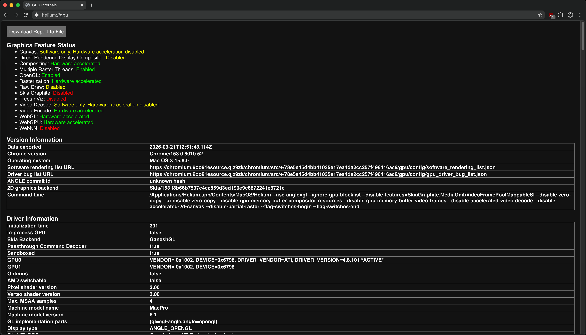

# Chromium Browsers Hardware Acceleration Patch for Legacy Mac GPUs
### Supports Google Chrome, Brave, Opera & Helium Browser on macOS Sequoia & Sonoma via OCLP
### Optimized for Mac Pro 6,1 (Dual AMD FirePro D700 / D500 / D300) & Legacy Metal 1 GPUs

[-blue.svg)](#)
[](#)
[](#)
[](https://github.com/khoinguyen88kt/chrome-macpro-gpu-patch/releases)
[](LICENSE)

---

🌐 **Languages / Ngôn ngữ:** **English** | [Tiếng Việt](README.vi.md)

---

## 📖 Overview

Across **Chromium 129–152**, Google progressively moved macOS onto Metal and ultimately removed the ANGLE OpenGL backend entirely:

* **M129** — ANGLE/Metal became the default backend on all Macs (`kDefaultANGLEMetal` enabled unconditionally).
* **M141** — the `chrome://flags#use-angle` entry was removed on macOS ([CL 6965659](https://chromium-review.googlesource.com/c/chromium/src/+/6965659)), so the backend could no longer be pinned from the browser UI.
* **M152** — the ANGLE CGL/GL backend was removed from `GetAllowedGLImplementations()` in `ui/gl/init/gl_factory_mac.cc` ([CL 7898546](https://chromium-review.googlesource.com/c/chromium/src/+/7898546), [crbug 519633318](https://issues.chromium.org/issues/519633318)). From M152 onward `--use-angle=gl` is *rejected* rather than ignored — `ui/gl/init/gl_factory.cc` logs `Requested GL implementation ... not found in allowed implementations` and returns `kGLImplementationNone`, so GPU initialisation fails outright. This is precisely why patching `GetAllowedGLImplementations` is required on current builds rather than passing the flag alone.

Note that on **Chromium 130–151 the `--use-angle=gl` flag still works on macOS unpatched**, which is useful when deciding whether a given browser build needs the full patch. For legacy Mac hardware running modern macOS through **OpenCore Legacy Patcher (OCLP)** — notably the **Mac Pro 6,1 (Late 2013 "Trash Can")** equipped with **Dual AMD FirePro D700 / D500 / D300 (GCN 1.0 architecture)** — these GPUs lack support for modern Metal features (Metal 2.4/3, ray-tracing, modern shader tile memory). Consequently:

1. **OpenGL is completely disabled**: Chrome falls back to Software Rendering, causing severe lag, UI stutter, and massive CPU usage. Moving the mouse over UI elements or navigating to YouTube crashes the GPU process immediately.
2. **Checkerboard / Black Grid Tiles**: Toolbars, bookmarks, tabs, and web pages are corrupted with repeating black rectangular grid artifacts due to Zero-Copy texture coordinate mismatches.
3. **YouTube Video Green Screen**: Software-decoded video frames fail to map properly onto multi-plane YUV IOSurfaces, turning the video player into a solid green box or stuck thumbnail.
4. **Ambient Mode Ghost Thumbnail Leak**: YouTube's Ambient Mode (cinematics canvas) leaks cached recommendation thumbnails behind and beneath the video player due to dirty OpenGL texture recycling.
5. **Search Bar Background Flicker**: Hovering over video thumbnails on YouTube triggers inline thumbnail playback; partial tile rasterization updates cause gamma/sRGB state bleeding that makes the search bar background flicker continuously.

This repository provides an **automated, clean, and 100% stable solution** that restores full GPU hardware acceleration (**Compositing, Rasterization, OpenGL, WebGL, WebGPU**) on Google Chrome without visual artifacts or crashes.

---

## 🛠️ Prerequisites & Dependencies

Before running the patcher, ensure your system has the following:

1. **Xcode Command Line Tools** (provides the `clang` compiler and macOS SDK headers):
   ```bash
   xcode-select --install
   ```
2. **Python 3**:
   * Built-in on macOS or installed via Homebrew (`brew install python3`).
   * Only utilizes Python standard libraries (`os`, `sys`, `shutil`, `subprocess`, `glob`). **No external `pip` packages required**.
3. **macOS System Security Utilities**:
   * `/usr/bin/codesign`, `/usr/bin/security`, and `/usr/bin/openssl` (standard on all macOS installations).
4. **Local Self-Signed Certificate (`LocalCodeSigner`)**:
   * An automated setup script is included in this repository.

---

## 🚀 Quick Start Guide

### Step 1: Clone the Repository
```bash
git clone https://github.com/khoinguyen88kt/chrome-macpro-gpu-patch.git
cd chrome-macpro-gpu-patch
```

### Step 2: Set up the Local Code Signing Certificate (One-time only)
Run the automated script to generate and install the `LocalCodeSigner` certificate into your macOS Keychain:
```bash
bash setup_certificate.sh
```

### Step 3: Run the Automated Patcher
Make sure the browser you wish to patch is closed, then run:

```bash
# Auto-detect and patch ALL installed browsers (Chrome, Opera, Brave, etc.)
python3 patch.py

# Or patch a specific browser:
python3 patch.py chrome
python3 patch.py brave
python3 patch.py opera
python3 patch.py helium
```
*The script will automatically create safe backups, scan and patch framework binaries, compile the optimized native C launcher, and re-sign the application bundle with `LocalCodeSigner`.*

#### CLI Options & Commands:
| Command | Description |
| :--- | :--- |
| `python3 patch.py` | Auto-detects and patches all supported browsers installed on your Mac. |
| `python3 patch.py chrome` | Patches Google Chrome only. |
| `python3 patch.py brave` | Patches Brave Browser only. |
| `python3 patch.py opera` | Patches Opera Browser only. |
| `python3 patch.py helium` | Patches Helium Browser only. |
| `python3 patch.py brave --app-path "/path/to/Brave.app"` | Patches a browser at a custom/non-standard location. |
| `python3 patch.py --list` | Lists all supported browsers, detected install paths, and patch status. |
| `python3 patch.py --check all` | Checks if installed browsers are already fully patched and signed. |
| `python3 patch.py --update` | Updates the patcher to the latest version from GitHub. |
| `python3 patch.py --version` | Displays current patcher version. |
| `python3 patch.py --restore all` | Restores clean unpatched original binaries from backup for all browsers. |
| `python3 patch.py --restore chrome` | Restores original unpatched Google Chrome from backup. |
| `python3 patch.py --restore brave` | Restores original unpatched Brave Browser from backup. |
| `python3 patch.py --restore opera` | Restores original unpatched Opera from backup. |
| `python3 patch.py --restore helium` | Restores original unpatched Helium Browser from backup. |

### 🔄 Updating the Patcher
The patcher automatically checks for updates whenever run. To update:
- **If you cloned via Git**:
  ```bash
  python3 patch.py --update
  # Or: git pull origin main && python3 patch.py
  ```
- **If you downloaded a ZIP**:
  Download the latest release ZIP from the [GitHub Releases page](https://github.com/khoinguyen88kt/chrome-macpro-gpu-patch/releases), unpack it, and run `python3 patch.py`.

> [!NOTE]
> **Automatic Backup & Rollback**:
> Before any binary modification, pristine original frameworks and launchers are safely backed up to `~/.<browser>_macpro_backups/`. If any unexpected error occurs during patching or compiling, it **automatically rolls back** to the clean backup so the browser is never left in a broken state.

### Step 4: Launch Chrome & Verify
1. Launch Google Chrome from `/Applications/Google Chrome.app`.
2. *(If prompted)* macOS Keychain will show a dialog: *"Google Chrome wants to access key 'Chrome Safe Storage' in your keychain"*. Enter your macOS user password and click **"Always Allow"** to preserve your profile logins and cookies.
3. Navigate to `chrome://gpu` to verify:
   * **Compositing**: Hardware accelerated
   * **Rasterization**: Hardware accelerated (Multiple Raster Threads: Enabled)
   * **OpenGL**: **Enabled** (`ANGLE (ATI Technologies Inc., AMD Radeon HD - FirePro D700 OpenGL Engine, OpenGL 4.1 ATI-4.8.101)`)
   * **WebGL / WebGL 2**: Hardware accelerated
   * **WebGPU**: Hardware accelerated
   * **GPU Process Crash Count**: **0**

### Step 5: (Recommended) Enable Seamless Auto-Patching on Chrome Updates
Install the background **macOS LaunchAgent** service. Whenever Google Chrome updates in the background, `launchd` kernel file watchers detect the new version, automatically apply the patch, compile the launcher, and re-sign the app **before you click "Relaunch"**:
```bash
bash install_auto_patch_service.sh
```
*Zero CPU/RAM usage when idle. To uninstall anytime: `bash uninstall_auto_patch_service.sh`.*

---

## 📸 Screenshots & Proof of Verification

### 1. Hardware Acceleration Restored (`chrome://gpu`)
Full hardware acceleration enabled on macOS Sequoia 15.8 with GaneshGL and Dual AMD FirePro D700. Zero GPU crashes.

<p align="center">
  
</p>

### 2. Smooth 60fps YouTube Playback with Stats for Nerds
Fluid 60fps playback with 0 dropped frames, rich colors, and no visual artifacts or flickering.

<p align="center">
  
</p>

### 3. Test Machine Specifications
Verified on Mac Pro 6,1 (Late 2013) with Dual AMD FirePro D700 running macOS Sequoia 15.8 via OpenCore Legacy Patcher.

<p align="center">
  
</p>

### 4. Verified Tested Version (`chrome://settings/help`)
Fully tested and working on **Google Chrome 153.0.8010.53 (Official Build) (x86_64)** with continuous stability across browser updates.

<p align="center">
  
</p>

### 5. Helium Browser Hardware Acceleration Restored (`helium://gpu`)
Full hardware acceleration enabled on Helium Browser (Compositing, ANGLE OpenGL, WebGL, WebGPU, GaneshGL) on macOS Sequoia.

<p align="center">
  
</p>

---

## 🔬 Technical Deep Dive

### 1. Bypassing macOS OpenGL Disablement (Binary Patching)
The [`auto_patch_chrome.py`](auto_patch_chrome.py) script uses **Pattern Scanning** to locate and patch 7 critical code locations in `Google Chrome Framework`:

| # | Chromium Target Function | Original Byte Sequence | Patched Byte Sequence | Technical Purpose |
| :---: | :--- | :--- | :--- | :--- |
| **1** | `GetAllowedGLImplementation` | `84 c0 74 0f ...` | `84 c0 90 90 ...` | NOPs out the conditional jump that forbids ANGLE OpenGL on macOS. |
| **2** | `GetDisplayInitializationParams` | `84 c0 0f 85 06 06 00 00 ...` | `84 c0 e9 07 06 00 00 90 ...` | Forces `supports_angle_opengl` check to pass (`jmp +0x607`). |
| **3** | `InitializeGpuModes` | `c7 45 ac 03 00 00 00` | `c7 45 ac 01 00 00 00` | Forces GPU fallback mode to `GpuMode::HARDWARE_GL` (1) instead of `DISABLED` (3). |
| **4** | `GpuMain` Seatbelt Sandbox | `85 c0 0f 84 ed 00 00 00` | `85 c0 90 90 90 90 90 90` | NOPs out `CHECK(Seatbelt::IsSandboxed())` abort during CGL window initialization. |
| **5** | `IOSurfaceImageBackingFactory` | `48 8d b5 78 ... 89 44 24 10` | `48 8d b5 78 ... 41 b8 f5 84 00 00` | Sets IOSurface texture target to `GL_TEXTURE_RECTANGLE` (`0x84f5`). |
| **6** | `ScopedEGLSurfaceIOSurface::ValidateTarget` | `55 48 89 e5 41 56 ...` | `b0 01 c3 90 ...` | Patches validation to always return `true` (`mov al, 1; ret`). |
| **7** | `IOSurfaceImageBacking` constructor | `8b 45 d0 89 83 88 01 00 00` | `c7 83 88 01 00 00 f5 84 00 00` | Forces `gl_target_ = 0x84f5` across all IOSurface backing instances. |

---

### 2. Native C Launcher & Flag Injection (`chrome_main.c`)
Rather than using a fragile shell script wrapper, the main executable `/Applications/Google Chrome.app/Contents/MacOS/Google Chrome` is replaced by a native C binary compiled with Clang. It dynamically loads `Google Chrome Framework` via `dlopen` and invokes `ChromeMain` with the exact rendering flags required:

```c
static const char *kInjectedFlags[] = {
    "--use-angle=gl",
    "--ignore-gpu-blocklist",
    "--disable-features=SkiaGraphite,MediaGmbVideoFramePoolMappableSI",
    "--disable-zero-copy",
    "--ui-disable-zero-copy",
    "--disable-gpu-memory-buffer-compositor-resources",
    "--disable-gpu-memory-buffer-video-frames",
    "--disable-accelerated-video-decode",
    "--disable-accelerated-2d-canvas",
    "--disable-partial-raster",
};
```

#### Why Each Flag is Required:
* `--disable-zero-copy`, `--ui-disable-zero-copy`, `--disable-gpu-memory-buffer-compositor-resources`:
  * **Root Cause**: In Zero-Copy rasterization, tiles are backed by `IOSurface` (`GL_TEXTURE_RECTANGLE`). Chromium's compositor quad fragment shaders expect `sampler2D` with normalized $[0.0, 1.0]$ coordinates. Sampling rectangle textures with $[0..1]$ reads only the top-left $1\times 1$ pixel, creating repeating black square grids.
  * **Fix**: Switches to **One-Copy Rasterization**, uploading tiles into standard `GL_TEXTURE_2D` textures with $[0.0, 1.0]$ coordinates, **completely eliminating black grid tiles**.
* `--disable-gpu-memory-buffer-video-frames`, `--disable-features=MediaGmbVideoFramePoolMappableSI`, `--disable-accelerated-video-decode`:
  * **Root Cause**: Decoded YUV video frames wrapped in multi-plane IOSurfaces fail shader mapping on Apple CGL ($U=0, V=0 \to$ solid green).
  * **Fix**: Performs clean software decode (dav1d/libgav1) and transfers standard YUV textures directly to the GPU, **fixing green screen playback**.
* `--disable-accelerated-2d-canvas`:
  * **Root Cause**: YouTube Ambient Mode draws onto a `<canvas>` behind the player. On legacy CGL drivers, GPU texture recycling fails to clear previous thumbnail textures from the pool.
  * **Fix**: Forces 2D canvas to render via CPU Skia in RAM with 0% memory leaks, while 3D, WebGL, WebGPU, and Compositing stay fully accelerated on the GPU.
* `--disable-partial-raster`:
  * **Root Cause**: Top-row compositor tiles cover both the masthead (search bar) and video thumbnails. Sub-texture updates (`glTexSubImage2D`) at 60 FPS cause texture cache and gamma/sRGB state bleeding into neighboring static UI pixels.
  * **Fix**: Forces full clean tile rasterization on damage, **eliminating search bar background flicker**.

---

## 🔄 Maintaining Patches Across Chrome Updates

### How easy is it when Chrome updates?
**Extremely easy and completely automated!**

1. **Robust Pattern Scanning**:
   * The script does not rely on hardcoded memory addresses. As Chrome updates through point releases (e.g. `153.0.8010.50` $\to$ `153.0.8010.60`), the assembly opcode signatures remain identical.
   * Re-patching takes approximately **2 to 3 seconds**.
2. **Re-patch Command**:
   Whenever Chrome auto-updates or is updated, simply run:
   ```bash
   python3 auto_patch_chrome.py
   ```
3. **(Optional) Prevent Unwanted Background Updates**:
   To prevent Google Keystone from updating Chrome in the background without your knowledge:
   ```bash
   defaults write com.google.Keystone.Agent checkInterval 0
   ```
   *(To re-enable automatic updates later: `defaults delete com.google.Keystone.Agent checkInterval`).*

---

## 📂 Repository Structure
 
```
chrome-macpro-gpu-patch/
├── patch.py                        # Unified multi-browser patcher CLI (main entrypoint)
├── auto_patch_chrome.py            # Backward-compatible Chrome LaunchAgent runner
├── patchers/                       # Modular browser patchers
│   ├── __init__.py                 # Registry of supported browsers
│   ├── base.py                     # BaseBrowserPatcher engine (codesigning, backup, patching)
│   ├── chrome.py                   # Google Chrome patcher module (7 patterns)
│   ├── brave.py                    # Brave Browser patcher module (7 patterns)
│   ├── opera.py                    # Opera Browser patcher module (5 patterns + dylib inject)
│   └── helium.py                   # Helium Browser patcher module (7 patterns + GL factory bypass)
├── chrome_main.c                   # Google Chrome native C launcher (flag injection)
├── brave_main.c                    # Brave Browser native C launcher (flag injection)
├── opera_main.c                    # Opera Browser native C launcher (flag injection)
├── helium_main.c                   # Helium Browser native C launcher (flag injection)
├── setup_certificate.sh            # Script to create and install LocalCodeSigner certificate
├── angle_dylibs/                   # Pre-extracted clean ANGLE dylibs (libEGL.dylib, libGLESv2.dylib)
├── install_auto_patch_service.sh   # Background LaunchAgent service installer
├── uninstall_auto_patch_service.sh # Background LaunchAgent service uninstaller
├── docs/images/                    # Verification screenshots and assets
├── .gitignore                      # Ignores build artifacts and temporary files
└── LICENSE                         # MIT Open Source License
```

---

## 📄 License

This project is licensed under the **MIT License**. Feel free to use, modify, and distribute it to help the legacy Mac and OpenCore Legacy Patcher community!

---

## ⚖️ Disclaimer

* This project is an independent, open-source community research effort created solely to restore hardware compatibility and accessibility for legacy Mac hardware on modern macOS releases.
* This project is **not affiliated with, maintained, authorized, endorsed, or sponsored by** Google LLC, Alphabet Inc., Apple Inc., or any of their affiliates.
* **Google Chrome** is a registered trademark of Google LLC. **macOS**, **Mac Pro**, and **Metal** are registered trademarks of Apple Inc.
* All code modifications are performed locally on the user's machine. This repository does not host, distribute, or redistribute any copyrighted proprietary binaries of Google Chrome or macOS.
* The software and scripts are provided **"as-is"**, without warranty of any kind, express or implied, as outlined in the [MIT License](LICENSE). Users assume full responsibility for applying these modifications to their local installations.

