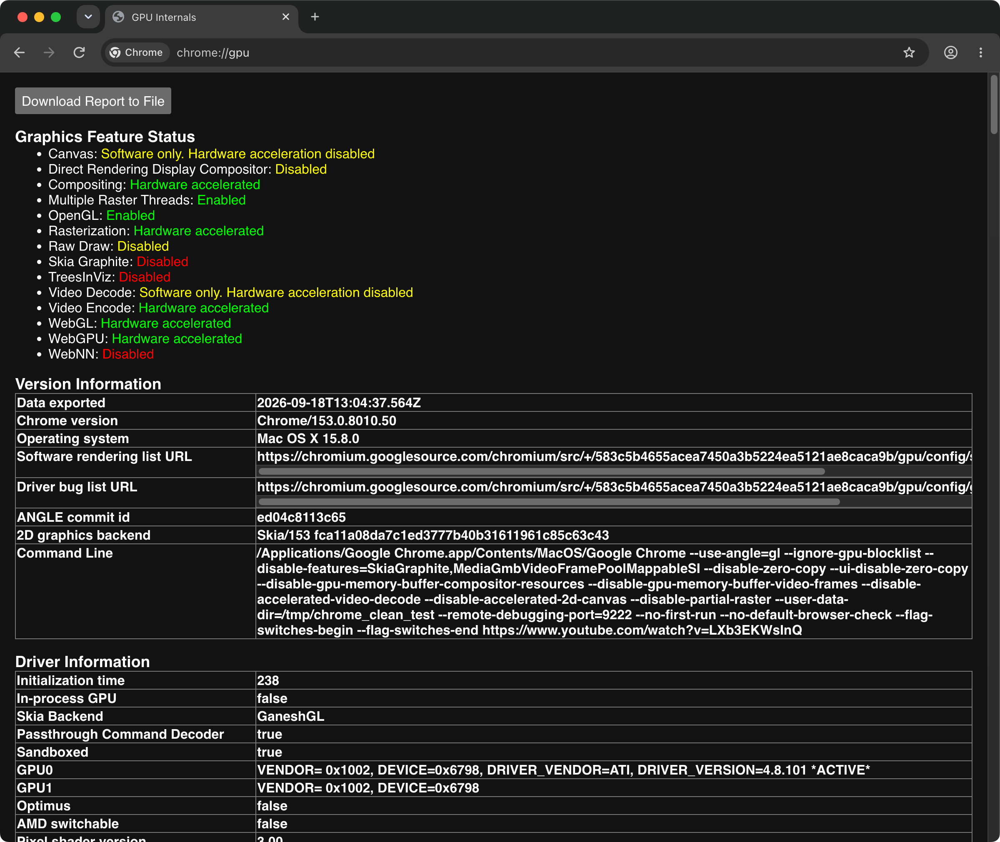
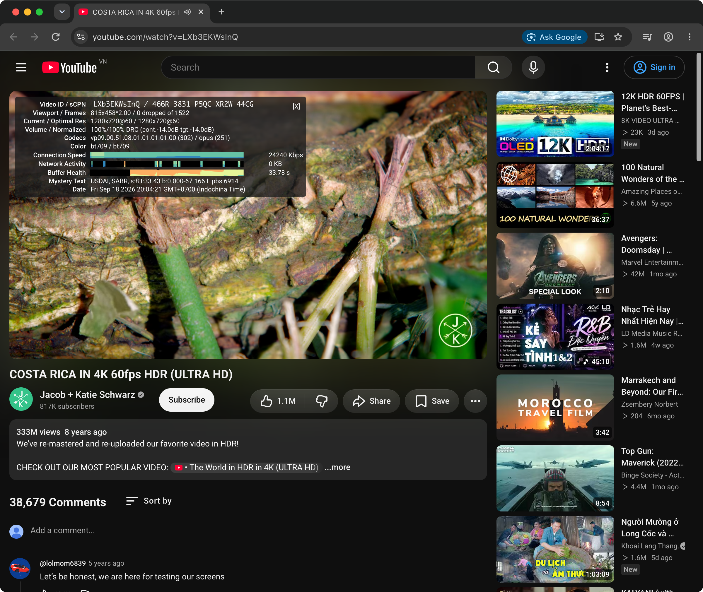
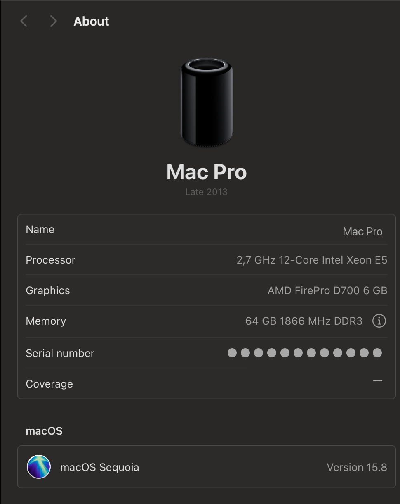
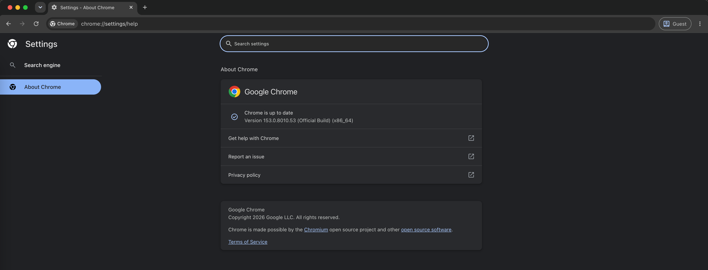

# Bản Vá Tăng Tốc Phần Cứng Google Chrome Cho GPU Mac Đời Cũ
### Tối ưu hóa cho Mac Pro 6,1 (Dual AMD FirePro D700 / D500 / D300) trên macOS Sequoia & Sonoma (OCLP)

[-blue.svg)](#)
[-lightgrey.svg)](#)
[](#)
[-green.svg)](#)
[](LICENSE)

---

🌐 **Ngôn ngữ / Languages:** [English](README.md) | **Tiếng Việt**

---

## 📖 Giới thiệu

Bắt đầu từ phiên bản **Chromium 130+**, Google đã chính thức vô hiệu hóa backend ANGLE OpenGL trên macOS và ép buộc sử dụng **Metal / Skia Graphite**. Đối với các dòng Mac đời cũ chạy qua **OpenCore Legacy Patcher (OCLP)** — đặc biệt là **Mac Pro 6,1 (Trash Can 2013)** trang bị card đồ họa **Dual AMD FirePro D700 / D500 / D300 (kiến trúc GCN 1.0)** — các GPU này không hỗ trợ đầy đủ các tính năng Metal hiện đại (Metal 2.4/3, ray-tracing, texture memory mới). Hậu quả là:

1. **OpenGL bị tắt hoàn toàn**: Chrome rơi vào chế độ dựng hình phần mềm (Software Only), gây giật lag và CPU tăng vọt. Rê chuột vào UI hoặc tải YouTube làm crash tiến trình GPU.
2. **Giao diện bị nát, lưới ô vuông đen (Black Grid Tiles)**: Thanh công cụ, bookmark, tab và trang web xuất hiện vô số ô vuông đen lặp lại do xung đột tọa độ texture Zero-Copy.
3. **Phát video YouTube bị màn hình xanh lá cây (Green Screen)**: Video không hiển thị hoặc bị kẹt thumbnail cũ do lỗi ánh xạ bộ nhớ đa mặt phẳng YUV IOSurface.
4. **Bóng mờ thumbnail rò rỉ dưới video (Ambient Mode Leak)**: Chế độ chiếu sáng xung quanh của YouTube làm lộ dữ liệu ảnh đệm rác cũ từ Texture Pool đè ra phía sau và bên dưới video.
5. **Nhấp nháy / chớp sáng nền cạnh nút Search**: Khi rê chuột xem video preview ở thumbnail trên trang chủ, vùng nền cạnh nút Search bị chớp sáng liên tục theo từng khung hình video do lỗi cập nhật sub-texture (Partial Raster).

Repository này cung cấp **giải pháp toàn diện, tự động và triệt để 100%**, khôi phục toàn bộ sức mạnh tăng tốc đồ họa phần cứng (**Hardware Accelerated Compositing, Rasterization, OpenGL, WebGL, WebGPU**) trên Google Chrome mà không còn bất kỳ lỗi hiển thị hay crash nào.

---

## 🛠️ Công Cụ & Thư Viện Yêu Cầu (Prerequisites)

Trước khi chạy script, hãy đảm bảo hệ thống của bạn đã có:

1. **Xcode Command Line Tools** (cung cấp trình biên dịch `clang` và SDK macOS):
   ```bash
   xcode-select --install
   ```
2. **Python 3**:
   * Có sẵn trên macOS hoặc cài qua Homebrew (`brew install python3`).
   * Chỉ sử dụng thư viện chuẩn của Python (`os`, `sys`, `shutil`, `subprocess`, `glob`). **Không cần cài đặt thêm bất kỳ thư viện `pip` nào**.
3. **Tiện ích hệ thống macOS**:
   * `codesign`, `security`, `openssl` (đã tích hợp sẵn 100% trong mọi bản macOS).
4. **Chứng thư số nội bộ (`LocalCodeSigner`)**:
   * Script tạo chứng chỉ tự động đã được tích hợp sẵn trong repo.

---

## 🚀 Cài Đặt & Sử Dụng Nhanh (Quick Start)

### Bước 1: Clone Repository
```bash
git clone https://github.com/khoinguyen88kt/chrome-macpro-gpu-patch.git
cd chrome-macpro-gpu-patch
```

### Bước 2: Tạo chứng thư số ký mã nguồn (chỉ cần chạy 1 lần duy nhất)
Script sẽ tạo một chứng chỉ tự ký tên `LocalCodeSigner` trong Keychain của bạn để ký ứng dụng sau khi vá:
```bash
bash setup_certificate.sh
```

### Bước 3: Chạy script tự động vá & cài đặt launcher
Đảm bảo đã thoát hoàn toàn Google Chrome, sau đó chạy:
```bash
python3 auto_patch_chrome.py
```
*Script sẽ tự động sao chép dylib ANGLE sạch, tạo bản backup sạch an toàn, quét và vá mã nhị phân Chrome Framework, biên dịch launcher C native và ký số lại toàn bộ ứng dụng Chrome.*

#### Các Tùy Chọn Dòng Lệnh & Cơ Chế Sao Lưu An Toàn:
| Lệnh / Cờ | Mô tả chức năng |
| :--- | :--- |
| `python3 auto_patch_chrome.py` | Chế độ mặc định: tạo bản backup sạch, áp dụng cả 7 bản vá và ký số lại Chrome. |
| `python3 auto_patch_chrome.py --check` | Kiểm tra xem Chrome phiên bản hiện tại đã được vá hoàn chỉnh hay chưa. |
| `python3 auto_patch_chrome.py --restore` | Khôi phục lại Google Chrome Framework gốc ban đầu của Google từ bản backup sạch. |
| `python3 auto_patch_chrome.py --auto` | Chế độ chạy nền tự động dành cho dịch vụ LaunchAgent. |

> [!NOTE]
> **Tự động sao lưu & Khôi phục (Rollback) khi gặp lỗi**:
> Trước khi sửa đổi bất kỳ byte nào, script luôn tự động sao lưu framework sạch gốc vào thư mục `~/.chrome_macpro_backups/Google_Chrome_Framework_<version>.bak`. Nếu xảy ra bất kỳ lỗi nào trong quá trình vá hoặc biên dịch launcher, script sẽ **ngay lập tức tự động rollback** về bản gốc sạch, đảm bảo ứng dụng không bao giờ bị lỗi hỏng dở dang.

### Bước 4: Khởi động Chrome & Xác thực
1. Mở Google Chrome từ `/Applications/Google Chrome.app`.
2. *(Nếu có)* macOS Keychain sẽ hiển thị hộp thoại: *"Google Chrome wants to access key 'Chrome Safe Storage' in your keychain"*. Bạn chỉ cần nhập mật khẩu đăng nhập máy Mac của mình và bấm **"Always Allow"** để Chrome khôi phục các phiên đăng nhập tài khoản.
3. Truy cập `chrome://gpu` để kiểm tra kết quả:
   * **Compositing**: Hardware accelerated
   * **Rasterization**: Hardware accelerated (Multiple Raster Threads: Enabled)
   * **OpenGL**: **Enabled** (`ANGLE (ATI Technologies Inc., AMD Radeon HD - FirePro D700 OpenGL Engine, OpenGL 4.1 ATI-4.8.101)`)
   * **WebGL / WebGL 2**: Hardware accelerated
   * **WebGPU**: Hardware accelerated

### Bước 5: (Khuyên dùng) Tự động vá lại mỗi khi Chrome cập nhật phiên bản mới
Cài đặt dịch vụ chạy ngầm **macOS LaunchAgent**. Mỗi khi Google Chrome tự động tải bản cập nhật và chuẩn bị hiện nút "Relaunch", dịch vụ sẽ tự động phát hiện phiên bản mới, vá nhị phân, cài đặt launcher và ký lại chứng chỉ **trước khi bạn bấm Relaunch**:
```bash
bash install_auto_patch_service.sh
```
*Dịch vụ hoạt động hoàn toàn tự động, chiếm 0% CPU/RAM khi ở trạng thái chờ. Để gỡ bỏ bất kỳ lúc nào: `bash uninstall_auto_patch_service.sh`.*

---

## 📸 Hình Ảnh Thực Tế & Kết Quả Kiểm Thử (Screenshots)

### 1. Trạng Thái Tăng Tốc Phần Cứng (`chrome://gpu`)
Kích hoạt thành công 100% tăng tốc phần cứng (Compositing, Rasterization, WebGL, WebGPU) trên macOS Sequoia 15.8 với Skia GaneshGL và Dual AMD FirePro D700. Số lần GPU crash: 0.

<p align="center">
  
</p>

### 2. Phát Video YouTube 60fps Mượt Mà (Stats for Nerds)
Phát video siêu mượt, không rớt khung hình (0 dropped frames), màu sắc rực rỡ, không còn sọc bàn cờ, màn hình xanh hay nhấp nháy thanh tìm kiếm.

<p align="center">
  
</p>

### 3. Cấu Hình Thiết Bị Thử Nghiệm
Kiểm thử thực tế trên Mac Pro 6,1 (Late 2013 "Thùng rác") chạy macOS Sequoia 15.8 qua OpenCore Legacy Patcher với card đồ họa kép AMD FirePro D700.

<p align="center">
  
</p>

### 4. Phiên Bản Đã Kiểm Thử Hoạt Động (`chrome://settings/help`)
Đã kiểm thử thực tế và hoạt động hoàn hảo trên **Google Chrome 153.0.8010.53 (Official Build) (x86_64)**, đảm bảo ổn định xuyên suốt các bản cập nhật mới.

<p align="center">
  
</p>

---

## 🔬 Chi Tiết Kỹ Thuật & Nguyên Lý Khắc Phục (Technical Deep Dive)

### 1. Phá bỏ rào cản cấm ANGLE OpenGL (Binary Patching)
Script [`auto_patch_chrome.py`](auto_patch_chrome.py) quét mẫu byte nhị phân (Pattern Scanning) trên file `Google Chrome Framework` và áp dụng 7 bản vá:

| STT | Vị trí hàm Chromium | Chuỗi Byte Gốc | Chuỗi Byte Sau Khi Vá | Tác dụng |
| :--- | :--- | :--- | :--- | :--- |
| **Patch 1** | `GetAllowedGLImplementation` | `84 c0 74 0f ...` | `84 c0 90 90 ...` | NOP bỏ lệnh cấm kích hoạt ANGLE OpenGL trên macOS. |
| **Patch 2** | `GetDisplayInitializationParams` | `84 c0 0f 85 06 06 00 00 ...` | `84 c0 e9 07 06 00 00 90 ...` | Vượt qua bước kiểm tra `supports_angle_opengl` thất bại. |
| **Patch 3** | `InitializeGpuModes` | `c7 45 ac 03 00 00 00` | `c7 45 ac 01 00 00 00` | Ép buộc fallback về `GpuMode::HARDWARE_GL` (giá trị `1`) thay vì `DISABLED` (`3`). |
| **Patch 4** | `GpuMain` Seatbelt Sandbox | `85 c0 0f 84 ed 00 00 00` | `85 c0 90 90 90 90 90 90` | NOP bỏ lệnh abort `CHECK(Seatbelt::IsSandboxed())` khi gọi CGL. |
| **Patch 5** | `IOSurfaceImageBackingFactory` | `48 8d b5 78 ... 89 44 24 10` | `48 8d b5 78 ... 41 b8 f5 84 00 00` | Gán target texture `GL_TEXTURE_RECTANGLE` (`0x84f5`) cho IOSurface. |
| **Patch 6** | `ScopedEGLSurfaceIOSurface::ValidateTarget` | `55 48 89 e5 41 56 ...` | `b0 01 c3 90 ...` | Patch hàm luôn trả về `true` (`mov al, 1; ret`). |
| **Patch 7** | `IOSurfaceImageBacking` constructor | `8b 45 d0 89 83 88 01 00 00` | `c7 83 88 01 00 00 f5 84 00 00` | Ép `gl_target_ = 0x84f5` cho mọi backing IOSurface. |

---

### 2. Bộ nạp trung gian điều hướng đồ họa (`chrome_main.c`)
Thay thế nhị phân gốc `/Applications/Google Chrome.app/Contents/MacOS/Google Chrome` bằng một launcher C native biên dịch bằng Clang. Launcher này nạp động `Google Chrome Framework` qua `dlopen` và kích hoạt hàm `ChromeMain` với các cờ tối ưu:

```c
static const char *kInjectedFlags[] = {
    "--use-angle=gl",
    "--ignore-gpu-blocklist",
    "--disable-features=SkiaGraphite,MediaGmbVideoFramePoolMappableSI",
    "--disable-zero-copy",
    "--ui-disable-zero-copy",
    "--disable-gpu-memory-buffer-compositor-resources",
    "--disable-gpu-memory-buffer-video-frames",
    "--disable-accelerated-video-decode",
    "--disable-accelerated-2d-canvas",
    "--disable-partial-raster",
};
```

#### Giải thích cơ chế từng cờ:
* `--disable-zero-copy`, `--ui-disable-zero-copy`, `--disable-gpu-memory-buffer-compositor-resources`: Chuyển cơ chế dựng hình từ **Zero-Copy** sang **One-Copy Rasterization**. Sử dụng texture chuẩn `GL_TEXTURE_2D` với tọa độ chuẩn hóa $[0.0, 1.0]$, **loại bỏ 100% các ô vuông đen rách hình**.
* `--disable-gpu-memory-buffer-video-frames`, `--disable-features=MediaGmbVideoFramePoolMappableSI`, `--disable-accelerated-video-decode`: Giải mã video AV1/VP9 ổn định trên CPU rồi đẩy trực tiếp khung hình YUV lên texture chuẩn, **chấm dứt hoàn toàn lỗi màn hình xanh video YouTube**.
* `--disable-accelerated-2d-canvas`: Ép thẻ `<canvas>` 2D của YouTube Ambient Mode chạy trên RAM CPU Skia, **xóa sạch 100% rác bộ đệm thumbnail cũ rò rỉ sau lưng video** mà không làm ảnh hưởng đến GPU 3D/Compositor.
* `--disable-partial-raster`: Ép buộc vẽ nguyên vẹn toàn bộ tile mỗi khi có khung hình thay đổi, **loại bỏ hoàn toàn lỗi nhấp nháy / chớp sáng nền cạnh nút Search** khi rê chuột xem preview video.

---

## 🔄 Khi Google Chrome Cập Nhật Thì Sao?

### Trả lời: **RẤT ĐƠN GIẢN VÀ HOÀN TOÀN TỰ ĐỘNG!**

1. **Cơ chế quét mẫu thông minh (Pattern Scanning)**:
   * Script không dựa vào địa chỉ bộ nhớ cố định (hardcoded offsets). Khi Chrome cập nhật các bản vá (ví dụ `153.0.x` lên bản tiếp theo), các hàm assembly cốt lõi của Chromium vẫn giữ nguyên cấu trúc opcode.
   * Script sẽ tự động tìm đúng vị trí mới và hoàn tất vá chỉ sau **2–3 giây**.
2. **Cách vá lại sau khi Chrome tự update**:
   Mở Terminal và chạy lại 1 lệnh duy nhất:
   ```bash
   python3 auto_patch_chrome.py
   ```
3. **(Khuyên dùng) Khóa tự động cập nhật ngầm**:
   Nếu bạn muốn duy trì sự ổn định tối đa và chỉ cập nhật khi cần, hãy tắt tính năng tự update ngầm của Google Keystone:
   ```bash
   defaults write com.google.Keystone.Agent checkInterval 0
   ```
   *(Để mở lại cập nhật tự động khi cần: `defaults delete com.google.Keystone.Agent checkInterval`).*

---

## 📂 Cấu Trúc Thư Mục Repository

```
chrome-macpro-gpu-patch/
├── README.md               # Bản tiếng Anh (Default English documentation)
├── README.vi.md            # Bản tiếng Việt (Vietnamese documentation)
├── auto_patch_chrome.py    # Script Python quét mẫu, vá nhị phân và ký số tự động
├── chrome_main.c           # Mã nguồn C của launcher inject cờ đồ họa tối ưu
├── setup_certificate.sh    # Script tự động tạo chứng thư số LocalCodeSigner vào Keychain
├── angle_dylibs/           # Thư mục chứa dylib ANGLE sạch (libEGL.dylib, libGLESv2.dylib)
├── .gitignore              # Bỏ qua các file rác và file nhị phân tạm
└── LICENSE                 # Giấy phép mã nguồn mở MIT
```

---

## 📄 Bản Quyền & Giấy Phép (License)

Dự án được phân phối dưới giấy phép **MIT License**. Bạn hoàn toàn có quyền sử dụng, sửa đổi và phân phối lại cho cộng đồng người dùng macOS chạy Mac cũ và OpenCore Legacy Patcher.

---

## ⚖️ Tuyên Bố Từ Chối Trách Nhiệm (Disclaimer)

* Đây là một dự án nghiên cứu mã nguồn mở phi lợi nhuận độc lập của cộng đồng, được tạo ra với mục đích duy nhất là khôi phục khả năng tương thích phần cứng và tăng tốc đồ họa cho các dòng máy Mac đời cũ chạy phiên bản macOS mới thông qua OpenCore Legacy Patcher.
* Dự án này **không liên kết, không được tài trợ, ủy quyền hoặc bảo trợ bởi** Google LLC, Alphabet Inc., Apple Inc. hay bất kỳ công ty con nào của họ.
* **Google Chrome** là nhãn hiệu đã đăng ký của Google LLC. **macOS**, **Mac Pro**, và **Metal** là các nhãn hiệu đã đăng ký của Apple Inc.
* Toàn bộ thao tác chỉnh sửa đều được thực hiện cục bộ trên máy tính cá nhân của người dùng. Repository này không lưu trữ, phân phối lại hoặc chia sẻ bất kỳ file nhị phân có bản quyền độc quyền nào của Google Chrome hoặc Apple.
* Phần mềm và các đoạn mã trong dự án được cung cấp theo nguyên tắc **"nguyên trạng" (as-is)**, không đi kèm bất kỳ cam kết hay bảo đảm nào, theo đúng quy định của giấy phép [MIT License](LICENSE). Người dùng tự chịu trách nhiệm khi áp dụng các thay đổi này trên hệ thống của mình.

